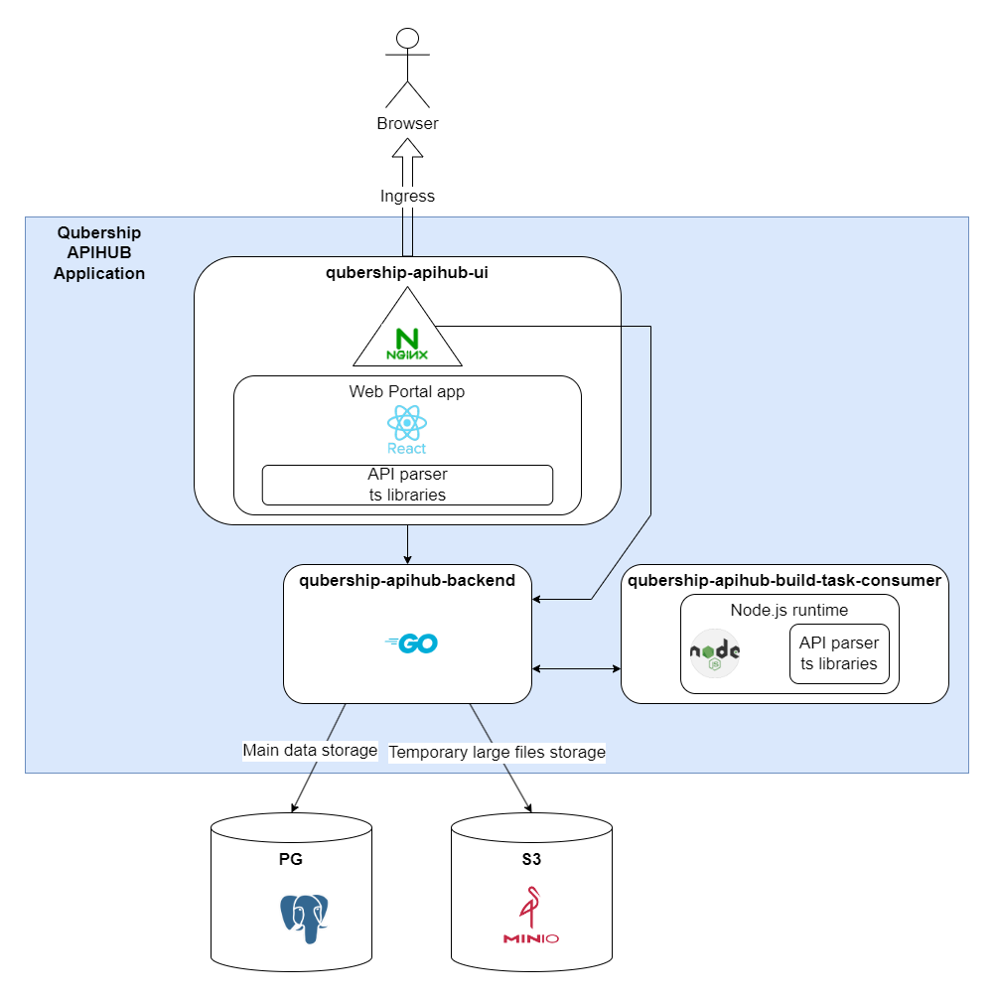

# Qubership APIHUB

**One place for your organization’s API specifications** — browse, compare, lint, and evolve APIs with confidence. Qubership APIHUB is Netcracker’s API **registry and Dev Portal**: a Kubernetes-native platform that turns scattered OpenAPI, GraphQL, AsyncAPI, and related specs into a **single source of truth**, with rich UI, automation, and optional cluster-side discovery.

---

## Why APIHUB?

| | |
|--|--|
| **Quality** | Normalize, diff, and classify changes (breaking vs safe) so teams ship compatible APIs. |
| **Visibility** | Search, dashboards, and versioning across workspaces — no more specs lost in repos or tickets. |
| **Integration** | Publish from CI/CD, lint on publish, export reports; MCP and AI-assisted workflows where configured. |
| **Scale** | Microservice architecture, horizontal workers, and pluggable extensions (linter, agents). |

**Outcomes you can expect:** higher documentation completeness, faster onboarding for consumers, and safer API evolution backed by structured diffs and optional quality scoring.

---

## What you get

- **Catalog & versioning** — Workspaces, groups, packages, versions, revisions; favorites and dashboards.
- **Multi-format specs** — OpenAPI 3.x (and Swagger 2 via conversion), **GraphQL**, **AsyncAPI**, Markdown documents, JSON Schema; gRPC/protobuf stubs where applicable.
- **Deep analysis** — Changelog between versions, deprecated tracking, backward-compatibility signals, global search.
- **Quality pipeline** — **Spectral** (OpenAPI & AsyncAPI) plus optional **AI-assisted** review for OpenAPI; **version-level scoring** in the linter service.
- **Rich Portal** — Interactive docs (including AsyncAPI), comparison views, API quality views, export with **document shareability** options.
- **Kubernetes agent (optional)** — Discover **OpenAPI, GraphQL, AsyncAPI**, Markdown, and JSON Schema in-cluster; snapshots and promotion into the catalog.
- **Enterprise-ready** — SAML, OIDC, LDAP, RBAC, API keys and PATs; Helm charts and Docker Compose for different lifecycles.

---

## Architecture at a glance

| Layer | Role |
|-------|------|
| **Portal UI** | React SPAs (Portal + Agents) behind nginx — unified entry for users and operators. |
| **API Registry** | Go backend: REST API, auth, packages/versions, build orchestration, MCP & AI chat hooks. |
| **Builder** | NestJS workers consume the TypeScript processing stack (normalize → diff → changelog → export). |
| **Extensions** | API Linter (Spectral / AI / scoring), Agents Backend for remote discovery agents. |

For a **detailed** diagram, API-type matrix, and extension roadmap, see the **[Architecture landscape](https://github.com/Netcracker/qubership-apihub/wiki/Architecture-landscape)** on the wiki.  
For a **full feature list**, see **[Features list](https://github.com/Netcracker/qubership-apihub/wiki/Features-list)**.

---

## Core components

### API Registry (backend)

The central **Go** service: REST API, authentication (SAML / OIDC / LDAP), RBAC, package and version lifecycle, build task orchestration, and integrations (e.g. MCP server, AI chat). It persists state in PostgreSQL and coordinates asynchronous builds and notifications.

**Repository:** [qubership-apihub-backend](https://github.com/Netcracker/qubership-apihub-backend)

### Builder service

Stateless **NestJS** workers pull build tasks, run the **api-processor** pipeline (parse → operations → normalize → diff → changelog / export), and return artifacts to the registry. Supports REST, GraphQL, AsyncAPI, Markdown, and unknown/generic documents.

**Repository:** [qubership-apihub-build-task-consumer](https://github.com/Netcracker/qubership-apihub-build-task-consumer)

### Web portal

**React** + **MUI** + **Vite**: the main Dev Portal for browsing the catalog, comparing versions, viewing API quality, managing settings, and (separately) the **Agents** app for cluster discovery workflows.

**Repository:** [qubership-apihub-ui](https://github.com/Netcracker/qubership-apihub-ui)

---

## Extensions (typical delivery)

### API Linter service

Pluggable quality gate: **Spectral** for OpenAPI and AsyncAPI, optional **OpenAI**-based review for OpenAPI, plus **aggregated version scoring** exposed via the linter API. Subscribes to publish events so new versions are validated automatically.

**Repository:** [qubership-api-linter-service](https://github.com/Netcracker/qubership-api-linter-service)

### APIHUB Agents

**Agents backend** registers and manages **APIHUB agents** deployed in customer clusters. Agents perform **service discovery** (OpenAPI, GraphQL, AsyncAPI, Markdown, JSON Schema, and more) and support snapshots and promotion flows.

- [qubership-apihub-agents-backend](https://github.com/Netcracker/qubership-apihub-agents-backend)  
- [qubership-apihub-agent](https://github.com/Netcracker/qubership-apihub-agent)

More context: [Supplementary applications](https://github.com/Netcracker/qubership-apihub/wiki#supplementary-applications) on the wiki.

---

## Documentation

| | |
|--|--|
| **Hub (start here)** | [docs/README.md](./docs/README.md) — maps guides, Helm, Compose, ERD, wiki links |
| **Installation** | [docs/installation-guide.md](./docs/installation-guide.md) |
| **Administration** | [docs/admin-guide.md](./docs/admin-guide.md) |
| **User guide** | [docs/user-guide.md](./docs/user-guide.md) |
| **Maintenance** | [docs/maintenance-guide.md](./docs/maintenance-guide.md) |
| **Project history** | [docs/apihub-history.md](./docs/apihub-history.md) |
| **Wiki** | [Qubership APIHUB Wiki](https://github.com/Netcracker/qubership-apihub/wiki) |

---

## Deploy

- **Helm** (production-oriented): see [helm-templates/README.md](./helm-templates/README.md) and [docs/installation-guide.md](./docs/installation-guide.md).
- **Docker Compose** (dev/test): [docker-compose/apihub-generic/](./docker-compose/apihub-generic/).
- **Local Kubernetes quickstart** (developers / R&D, not production): [helm-templates/local-k8s-quickstart/README.md](./helm-templates/local-k8s-quickstart/README.md).

---

## Repository role

This repository (**qubership-apihub**) is the **umbrella deployment project**: Helm charts, Compose stacks, and product-level documentation. Application source code lives in the component repositories linked above; reusable CI is in [qubership-apihub-ci](https://github.com/Netcracker/qubership-apihub-ci).

---

> **Qubership APIHUB** — align teams on APIs, ship changes with clarity.
