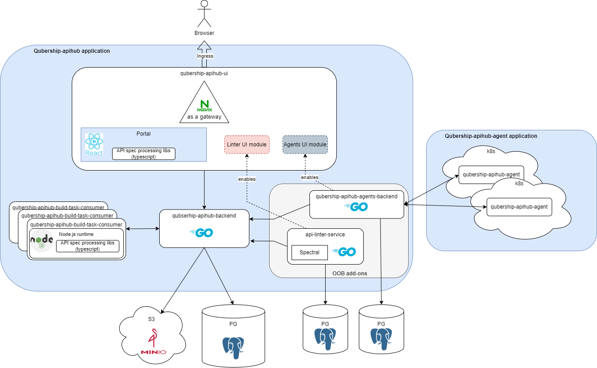

# Qubership APIHUB

**Qubership APIHUB** (QS-APIHUB) is a comprehensive solution designed to achieve the following goals:

1. Increase quality and completeness of API documentation
1. Provide a single point of truth for API Documentation
1. Integrate the product into existing workflows to boost productivity
1. Automate API backward compatibility validation with possibility to integrate it into CI/CD pipeline

It provides the following features

- Product API Catalog with versioning
- Rest API Support
- Import API from Swagger 2 / OpenApi 3.x
- Compare API
- Backward compatibility check
- Deprecated API tracking
- GraphQL support (beta)

## Modules

### High Level architecture

### API Registry 

The **API Registry** is a backend component that serves as a centralized repository for storing and managing API data. It stores API operations, documentation, metadata, and other relevant information.

See [qubership-apihub-backend](https://github.com/Netcracker/qubership-apihub-backend)

### Builder Service

**Builder Service** is responsible for validating and transforming uploaded API documents into a unified format. It supports various API document formats, such as Swagger, OpenAPI and GraphQL.

See [qubership-apihub-build-task-consumer](https://github.com/Netcracker/qubership-apihub-build-task-consumer)

### Web Portal

The **Web Portal** provides a user-friendly interface for interacting with the API Registry and accessing API documentation. It offers features such as search functionality, documentation browsing.

See [qubership-apihub-ui](https://github.com/Netcracker/qubership-apihub-ui)

### API Linter service add-on

The **API Linter service** is a pluggable add-on (included into OOB delivery be default) which enrich APIHUB Portal with an ability to do linting of API specification using 3rd party linting engine (spectral)

See [qubership-api-linter-service](https://github.com/Netcracker/qubership-api-linter-service)

See [APIHUB Wiki](https://github.com/Netcracker/qubership-apihub/wiki#supplementary-applications) for APIHUB add-ons architecture

# Documentation

## Installation Guide

[Installation Guide](./docs/installation-guide.md)

## Administration Guide

[Administration Guide](./docs/admin-guide.md)

## User Guide

[User Guide](./docs/user-guide.md)
